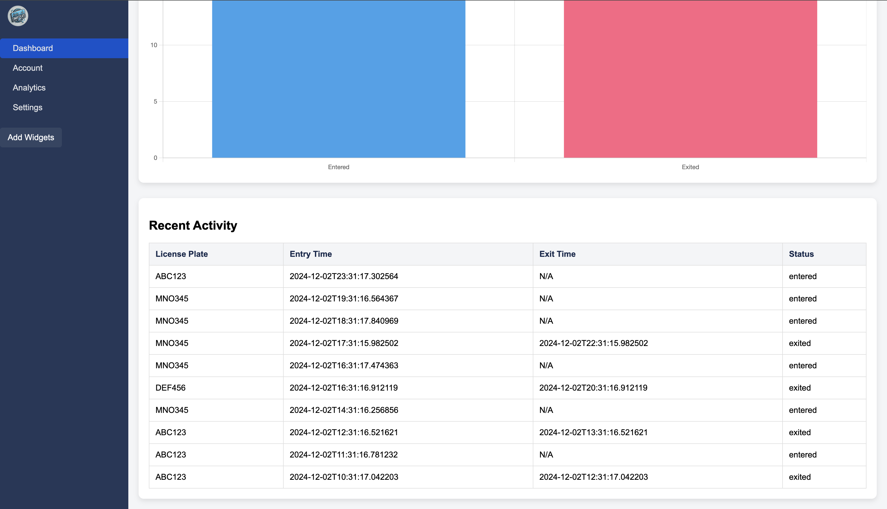

# 🚗 **Smart-Plate**: Revolutionizing Recognition 🚦

Welcome to **Smart-Plate**, an advanced AI-powered license plate recognition system. Designed for real-time vehicle tracking, Smart-Plate accurately captures and processes license plate data to streamline applications such as automated toll collection, traffic monitoring, and enhanced security.

---

## 🧠 **Key Features**
- **Real-Time Recognition**: Accurately identifies license plates on the go.
- **Analytics Dashboard**: A visually appealing dashboard to monitor vehicle activity.
- **Data-Driven Insights**: Provides actionable insights with detailed analytics.
- **Secure Storage**: MongoDB-backed database for efficient and secure data handling.
- **Scalable Design**: Built with Flask and modern web technologies for scalability.

---

## 📊 **Applications**
1. **Automated Toll Collection**: Enhance road toll efficiency with real-time vehicle data.
2. **Traffic Monitoring**: Gain insights into traffic patterns and vehicle movement.
3. **Security Systems**: Track and identify unauthorized vehicles in restricted areas.
4. **Parking Management**: Simplify parking systems by automating vehicle entry/exit logs.

---

## 🛠 **Technology Stack**
| Component             | Technology                    |
|-----------------------|-------------------------------|
| **Backend**           | Flask, Python                 |
| **Frontend**          | HTML5, CSS3, JavaScript       |
| **Database**          | MongoDB                       |
| **UI Framework**      | Chart.js                      |
| **Env. Management**   | dotenv                        |

---

## 📐 **System Architecture**
1. **License Plate Recognition**:
   - Real-time capture and analysis of license plate data.
2. **MongoDB Database**:
   - Securely stores license plate data including entry/exit times.
3. **Dashboard Interface**:
   - Provides interactive analytics and vehicle activity logs.
4. **API Endpoints**:
   - Efficient API for data management and retrieval.

---

## 🎯 **How It Works**
1. **Data Capture**:
   - Vehicles pass through the recognition system.
   - License plate data is captured in real-time.
2. **Data Processing**:
   - AI-powered algorithms analyze the license plates.
   - Data is stored in the MongoDB database.
3. **Visualization**:
   - A sleek dashboard displays insights such as:
     - Total vehicles.
     - Active and exited vehicles.
     - Recent activity logs.

---

## 🔧 **Setup Instructions**
1. **Clone the Repository**:
   ```bash
   git clone https://github.com/your-repo/Smart-Plate.git
   cd Smart-Plate
   ```
2. **Install Dependencies**:
   ```bash
   python3 -m venv venv
   source venv/bin/activate
   pip install -r requirements.txt
   ```
3. **Set Up MongoDB**:
   - Create a cluster in MongoDB.
   - Add a `.env` file with your MongoDB URI:
     ```env
     MONGO_URI=mongodb+srv://<username>:<password>@cluster.mongodb.net/smartplate?retryWrites=true&w=majority
     ```

4. **Run the Application**:
   ```bash
   python app.py
   ```
   - Access the app at `http://127.0.0.1:5000`.

---

## ✨ **Preview**


---

## 🤝 **Contributing**
We welcome contributions from the community! To contribute:
1. Fork the repository.
2. Create a feature branch:
   ```bash
   git checkout -b feature/new-feature
   ```
3. Commit your changes and create a pull request.

---

## 📄 **License**
This project is licensed under the MIT License. See the [LICENSE](LICENSE) file for details.

---

## 🚀 **Future Plans**
- Integration with cloud-based services for scalability.
- Advanced analytics powered by machine learning.
- Support for additional vehicle features such as make and model recognition.

---
