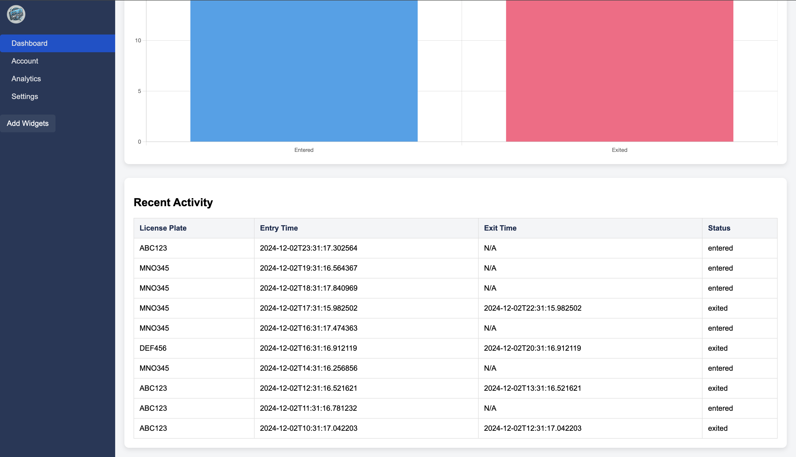

# 🚗 Smart-Plate: AI-Powered License Plate Recognition

Smart-Plate is an AI-powered, real-time license plate recognition system with a fully featured web dashboard.  
It captures vehicle entry/exit, allows fines and deletions, generates PDF reports with unique filenames, and includes user account management.

---

## 🧠 Key Features

- **Real-Time Plate OCR**  
  Uses OpenAI Vision to extract plate numbers & state from uploaded images.
- **Interactive Dashboard**  
  • Vehicle entry/exit logs  
  • “Fine” column & add-fine modal  
  • Delete (🗑️) entries on the spot  
  • Analytics charts (parked vs exited)
- **PDF Reporting**  
  Download a **SmartPlateReportXXX.pdf** (random 3-digit suffix) with full activity.
- **User Accounts**  
  Login/signup flow, profile edit, change password & **Sign Out** button in the sidebar.
- **Secure Data Storage**  
  MongoDB for entries & user profiles.
- **Scalable Flask API**  
  REST endpoints for all operations.

---

## 📊 Applications

1. **Parking Management**: Automate entry/exit & fines.  
2. **Security**: Audit vehicle movements, flag unpaid or fined vehicles.  
3. **Traffic Analytics**: Dashboard charts for usage patterns.

---

## 🔗 API Endpoints

| Route                            | Method | Description                                |
|----------------------------------|:------:|--------------------------------------------|
| `/dashboard-api/data`            |  GET   | Fetch stats & recent activity.             |
| `/dashboard-api/new-entry`       |  POST  | Upload image → OCR → create entry.         |
| `/dashboard-api/exit-entry/<id>` |  POST  | Mark an entry as exited (sets `exit_time`).|
| `/dashboard-api/add-fine/<id>`   |  POST  | Add a fine amount to an entry.             |
| `/dashboard-api/delete-entry/<id>`| DELETE| Permanently remove an entry.               |
| `/dashboard-api/report`          |  GET   | Download PDF report (randomized name).     |
| `/account-api/user-profile`      |  GET   | Get current user’s profile.                |
| `/account-api/update-profile`    |  PUT   | Update name/email/phone/address.           |
| `/account-api/change-password`   |  PUT   | Change the logged-in user’s password.      |
| `/logout`                        |  GET   | Sign out and clear session.                |

---

## 🛠️ Tech Stack

| Layer       | Tech                          |
|-------------|-------------------------------|
| **Backend** | Python, Flask                 |
| **DB**      | MongoDB                       |
| **Auth**    | Flask-Session (cookie based)  |
| **OCR**     | OpenAI Vision (gpt-4o)        |
| **Frontend**| HTML, CSS, JS, Chart.js       |
| **Env**     | python-dotenv                 |

---

## 📐 **System Architecture**
1. **Upload**: User uploads plate photo.  
2. **OCR**: Flask calls `process_license_plate()` → gpt-4o extracts plate & state.  
3. **Store**: Entry inserted into Mongo with `fines=0`, `status='entered'`.  
4. **Dashboard**:  
   - Shows stats, logs, fines & delete buttons.  
   - Charts auto-refresh via `/dashboard-api/data`.  
5. **Reporting**:  
   - `/dashboard-api/report` streams a PDF named `SmartPlateReport###.pdf`.

---

---

## 🎯 **How It Works**
1. **Data Capture**:
   - Vehicles pass through the recognition system.
   - License plate data is captured in real-time.
2. **Data Processing**:
   - AI-powered algorithms analyze the license plates.
   - Data is stored in the MongoDB database.
3. **Visualization**:
   - A sleek dashboard displays insights such as:
     - Total vehicles.
     - Active and exited vehicles.
     - Recent activity logs.

---

## 🔧 **Setup Instructions**
1. **Clone the Repository**:
   ```bash
   git clone https://github.com/your-repo/Smart-Plate.git
   cd Smart-Plate
   ```
2. **Install Dependencies**:
   ```bash
   python3 -m venv venv
   source venv/bin/activate
   pip install -r requirements.txt
   ```
3. **Set Up MongoDB**:
   - Create a cluster in MongoDB.
   - Add a `.env` file with your MongoDB URI:
     ```env
     MONGO_URI=mongodb+srv://<username>:<password>@cluster.mongodb.net/smartplate?retryWrites=true&w=majority
     ```

4. **Run the Application**:
   ```bash
   python app.py
   ```
   - Access the app at `http://127.0.0.1:5000`.

---

## ✨ **Preview**


---

## 🤝 **Contributing**
We welcome contributions from the community! To contribute:
1. Fork the repository.
2. Create a feature branch:
   ```bash
   git checkout -b feature/new-feature
   ```
3. Commit your changes and create a pull request.

---

## 📄 **License**
This project is licensed under the MIT License. See the [LICENSE](LICENSE) file for details.

---

## 🚀 **Future Plans**
- Integration with cloud-based services for scalability.
- Advanced analytics powered by machine learning.
- Support for additional vehicle features such as make and model recognition.

---
